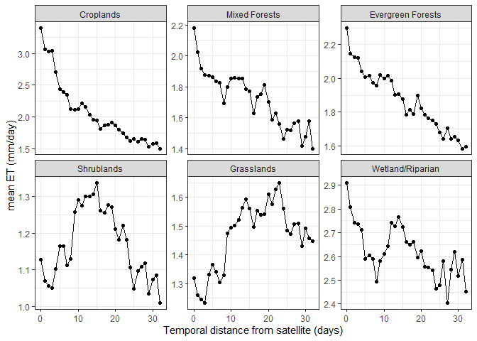
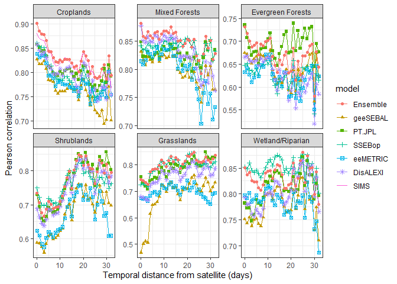
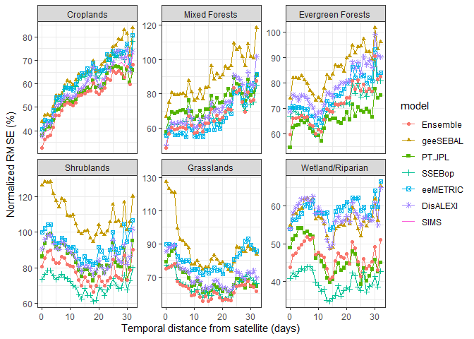
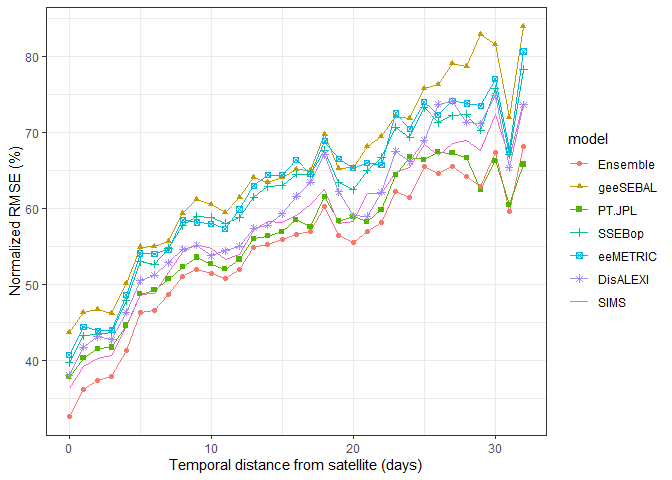
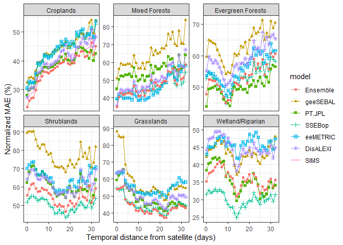
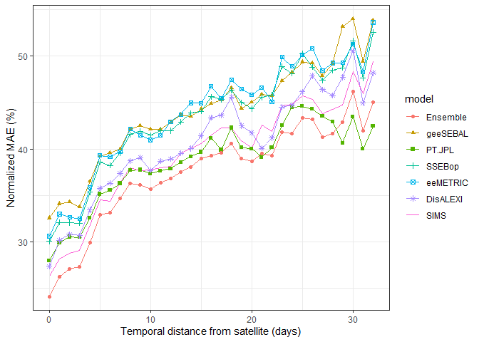

interpolation uncertainty analysis
================
Yeonuk Kim

## Data preparation

``` r
rm(list = ls())

library("tidyverse")
```

    ## ── Attaching core tidyverse packages ──────────────────────── tidyverse 2.0.0 ──
    ## ✔ dplyr     1.1.4     ✔ readr     2.1.5
    ## ✔ forcats   1.0.0     ✔ stringr   1.5.1
    ## ✔ ggplot2   3.5.1     ✔ tibble    3.2.1
    ## ✔ lubridate 1.9.4     ✔ tidyr     1.3.1
    ## ✔ purrr     1.0.2     
    ## ── Conflicts ────────────────────────────────────────── tidyverse_conflicts() ──
    ## ✖ dplyr::filter() masks stats::filter()
    ## ✖ dplyr::lag()    masks stats::lag()
    ## ℹ Use the conflicted package (<http://conflicted.r-lib.org/>) to force all conflicts to become errors

``` r
library("lubridate")
library(Metrics)

# interpolation max days
maxdays <- 32

### daily EC, OpenET, gridMET ETo
df <- read.csv("daily_data.csv")
df <- df %>% 
    mutate(DATE=as.Date(DATE),
                 YEAR = year(DATE),
                 MON = month(DATE)) 


# filter data to OpenET data available period
df <- df %>%
    mutate(RS_OBS = ifelse(!is.na(eeMETRIC),T,F),
                 RS_OBS_SIMS = ifelse(!is.na(SIMS),T,F),
                 ET_OBS = ifelse(!is.na(ET_corr),T,F)
    )

vaild_date <- df %>%
    filter(RS_OBS) %>%
    group_by(site) %>%
    summarise(start = min(DATE) - maxdays,
                        end = max(DATE) + maxdays)


df <- df %>% left_join(vaild_date)
```

    ## Joining with `by = join_by(site)`

``` r
df <- df %>% filter(DATE >= start & DATE <= end) %>%
    select(!start) %>% select(!end)


###
meta <- read.csv("station_metadata.csv",skip = 1)
colnames(meta)[1] <- "site"

meta_use <- meta %>% 
    select(site,General.classification,Land.cover.type) %>%
    rename(site=site, 
                 class1 = General.classification,
                 class2 = Land.cover.type) %>%
    mutate(is_crop = ifelse(class1 == "Croplands",TRUE,FALSE),
                 class1 = factor(class1,
                                                levels = c("Croplands","Mixed Forests","Evergreen Forests",
                                                                     "Shrublands","Grasslands","Wetland/Riparina",""))
                 )

df <- df %>% left_join(meta_use)
```

    ## Joining with `by = join_by(site)`

## Interpolation preparation

``` r
# nearest temporal distance
df <- df %>%
    group_by(site) %>%        
    arrange(DATE) %>%   
    mutate(nearest_distance = sapply(DATE, function(d) {
        if (any(RS_OBS)) {
            min(abs(as.numeric(difftime(DATE[RS_OBS], d, units = "days"))))
        } else {
            Inf  # No RS_OBS in the group at all
        }
    }))

# grouping for interpolation (if gap is longer than 32, set as different group)
cutting_long_gap <- function(x, maxgap){
    # Find positions where x equals maxgap
    pos <- which(x == maxgap+1)
    
    # Start with all observations in group 1
    group <- rep(1, length(x))
    
    if(length(pos) >= 1){
        # For the first occurrence, increment the group for observations after it
        if(pos[1] < length(x)){
            group[(pos[1] + 1):length(x)] <- group[(pos[1] + 1):length(x)] + 1
        }
        # For subsequent occurrences, increment the group starting from the occurrence itself
        if(length(pos) >= 2){
            for(i in 2:length(pos)){
                group[pos[i]:length(x)] <- group[pos[i]:length(x)] + 1
            }
        }
    }
    return(group)
}

df <- df %>%
    group_by(site) %>%
    arrange(DATE) %>%
    mutate(gap_group = cutting_long_gap(nearest_distance,maxdays)) %>%
    ungroup()

# EToF
df <- df %>%
    mutate(EToF_geeSEBAL = geeSEBAL/gridMET_ETo_corr,
                 EToF_PT.JPL = PT.JPL/gridMET_ETo_corr,
                 EToF_SSEBop = SSEBop/gridMET_ETo_corr,
                 EToF_SIMS = SIMS/gridMET_ETo_corr,
                 EToF_eeMETRIC = eeMETRIC/gridMET_ETo_corr,
                 EToF_DisALEXI = DisALEXI/gridMET_ETo_corr,
                 EToF_Ensemble = Ensemble/gridMET_ETo_corr,
                 
                 EToF_geeSEBAL = ifelse(EToF_geeSEBAL > 1.4, 1.4,ifelse(EToF_geeSEBAL < 0, 0, EToF_geeSEBAL)),
                 EToF_PT.JPL = ifelse(EToF_PT.JPL > 1.4, 1.4,ifelse(EToF_PT.JPL < 0, 0, EToF_PT.JPL)),
                 EToF_SSEBop = ifelse(EToF_SSEBop > 1.4, 1.4,ifelse(EToF_SSEBop < 0, 0, EToF_SSEBop)),
                 EToF_SIMS = ifelse(EToF_SIMS > 1.4, 1.4,ifelse(EToF_SIMS < 0, 0, EToF_SIMS)),
                 EToF_eeMETRIC = ifelse(EToF_eeMETRIC > 1.4, 1.4,ifelse(EToF_eeMETRIC < 0, 0, EToF_eeMETRIC)),
                 EToF_DisALEXI = ifelse(EToF_DisALEXI > 1.4, 1.4,ifelse(EToF_DisALEXI < 0, 0, EToF_DisALEXI)),
                 EToF_Ensemble = ifelse(EToF_Ensemble > 1.4, 1.4,ifelse(EToF_Ensemble < 0, 0, EToF_Ensemble)),
                 )
```

## Interpolation

``` r
### site filter
selected_site <- df %>% group_by(site) %>%
    summarise(n = sum(RS_OBS)) %>%
    filter(n > 1) %>%
    pull(site)

selected_site_SIMS <- df %>% group_by(site) %>%
    summarise(n = sum(RS_OBS_SIMS)) %>%
    filter(n > 1) %>%
    pull(site)

df <- df %>% filter(site %in% selected_site)
df_SIMS <- df %>% filter(site %in% selected_site_SIMS)


# linear interpolated
# Define a safe interpolation function
safe_approx <- function(x, y, new_x, rule = 2) {
    # Only interpolate if there are at least 2 non-NA y values
    if(sum(!is.na(y)) >= 2) {
        # Use only the non-NA indices for interpolation
        approx(x = x[!is.na(y)], y = y[!is.na(y)], 
                     xout = new_x, method = "linear", rule = rule)$y
    } else if(sum(!is.na(y)) == 1){
        approx(x = x[!is.na(y)], y = y[!is.na(y)], 
                     xout = new_x, method = "constant", rule = rule)$y
    } else {
        rep(NA, length(new_x))
    }
}

# interpolation
df <- df %>%
    group_by(site,gap_group) %>%        
    arrange(DATE) %>%   
    mutate(interpolated_EToF_geeSEBAL = safe_approx(seq_along(EToF_geeSEBAL), EToF_geeSEBAL, seq_along(EToF_geeSEBAL)),
                 interpolated_EToF_PT.JPL = safe_approx(seq_along(EToF_PT.JPL), EToF_PT.JPL, seq_along(EToF_PT.JPL)),
                 interpolated_EToF_SSEBop = safe_approx(seq_along(EToF_SSEBop), EToF_SSEBop, seq_along(EToF_SSEBop)),
                 interpolated_EToF_eeMETRIC = safe_approx(seq_along(EToF_eeMETRIC), EToF_eeMETRIC, seq_along(EToF_eeMETRIC)),
                 interpolated_EToF_DisALEXI = safe_approx(seq_along(EToF_DisALEXI), EToF_DisALEXI, seq_along(EToF_DisALEXI)),
                 interpolated_EToF_Ensemble = safe_approx(seq_along(EToF_Ensemble), EToF_Ensemble, seq_along(EToF_Ensemble)),
                 )

df_SIMS <- df_SIMS %>%
    group_by(site,gap_group) %>%        
    arrange(DATE) %>%   
    mutate(interpolated_EToF_SIMS = safe_approx(seq_along(EToF_SIMS), EToF_SIMS, seq_along(EToF_SIMS)))

df <- df %>% left_join(df_SIMS %>% select(site,DATE,interpolated_EToF_SIMS))
```

    ## Adding missing grouping variables: `gap_group`
    ## Joining with `by = join_by(site, DATE, gap_group)`

``` r
# Gap-filled (GF) ET for each model
df <- df %>%
    mutate(GF_geeSEBAL = interpolated_EToF_geeSEBAL * gridMET_ETo_corr,
                 GF_PT.JPL = interpolated_EToF_PT.JPL * gridMET_ETo_corr,
                 GF_SSEBop = interpolated_EToF_SSEBop * gridMET_ETo_corr,
                 GF_eeMETRIC = interpolated_EToF_eeMETRIC * gridMET_ETo_corr,
                 GF_DisALEXI = interpolated_EToF_DisALEXI * gridMET_ETo_corr,
                 GF_SIMS = interpolated_EToF_SIMS * gridMET_ETo_corr,
                 GF_Ensemble = interpolated_EToF_Ensemble * gridMET_ETo_corr,
                 )
```

## Normalized RMSE

``` r
for(i in c(0:32)){

    rmse_df <- df %>%
        ungroup() %>%
        group_by(class1) %>%
        filter(nearest_distance == i & ET_OBS == T & !is.na(GF_geeSEBAL)) %>%
        summarise(ETm = mean(ET_corr,na.rm=T),
                            
                            geeSEBAL = rmse(ET_corr,GF_geeSEBAL)/ETm,
                            PT.JPL = rmse(ET_corr,GF_PT.JPL)/ETm,
                            SSEBop = rmse(ET_corr,GF_SSEBop)/ETm,
                            eeMETRIC = rmse(ET_corr,GF_eeMETRIC)/ETm,
                            DisALEXI = rmse(ET_corr,GF_DisALEXI)/ETm,
                            SIMS = rmse(ET_corr,GF_SIMS)/ETm,
                            Ensemble = rmse(ET_corr,GF_Ensemble)/ETm,
                            
                            distance = i,
                            n = n()
        ) 
    
    if(i == 0){
        result <- rmse_df
    } else{
        result <- rbind(result,rmse_df)
    }
}

result %>%
    select(!n) %>%
    select(!ETm) %>%
    gather(key = "model",value = "nRMSE", -c(class1,distance)) %>%
    mutate(model = factor(model,
                                                levels = c("Ensemble","geeSEBAL","PT.JPL","SSEBop",
                                                                     "eeMETRIC","DisALEXI","SIMS"))
                 ) %>%
    ggplot(aes(distance,nRMSE*100,color = model, shape=model)) +
    geom_line() + 
    geom_point() +
    theme_bw() +
    labs(
        y = "Normalized RMSE (%)", 
        x = "Temporal distance from satellite (days)"
    ) +
    facet_wrap(~class1, scales = "free_y")
```

    ## Warning: The shape palette can deal with a maximum of 6 discrete values because more
    ## than 6 becomes difficult to discriminate
    ## ℹ you have requested 7 values. Consider specifying shapes manually if you need
    ##   that many have them.

    ## Warning: Removed 165 rows containing missing values or values outside the scale range
    ## (`geom_line()`).

    ## Warning: Removed 198 rows containing missing values or values outside the scale range
    ## (`geom_point()`).

<!-- -->

``` r
result %>%
    filter(class1 == "Croplands") %>%
    select(!n) %>%
    select(!ETm) %>%
    gather(key = "model",value = "nRMSE", -c(class1,distance)) %>%
    mutate(model = factor(model,
                                                levels = c("Ensemble","geeSEBAL","PT.JPL","SSEBop",
                                                                     "eeMETRIC","DisALEXI","SIMS"))
                 ) %>%
    ggplot(aes(distance,nRMSE*100,color = model, shape=model)) +
    geom_line() + 
    geom_point() +
    theme_bw() +
    labs(
        y = "Normalized RMSE (%)", 
        x = "Temporal distance from satellite (days)"
    )
```

    ## Warning: The shape palette can deal with a maximum of 6 discrete values because more
    ## than 6 becomes difficult to discriminate
    ## ℹ you have requested 7 values. Consider specifying shapes manually if you need
    ##   that many have them.

    ## Warning: Removed 33 rows containing missing values or values outside the scale range
    ## (`geom_point()`).

<!-- -->

## Normalized MAE

``` r
for(i in c(0:32)){

    rmse_df <- df %>%
        ungroup() %>%
        group_by(class1) %>%
        filter(nearest_distance == i & ET_OBS == T & !is.na(GF_geeSEBAL)) %>%
        summarise(ETm = mean(ET_corr,na.rm=T),
                            
                            geeSEBAL = mae(ET_corr,GF_geeSEBAL)/ETm,
                            PT.JPL = mae(ET_corr,GF_PT.JPL)/ETm,
                            SSEBop = mae(ET_corr,GF_SSEBop)/ETm,
                            eeMETRIC = mae(ET_corr,GF_eeMETRIC)/ETm,
                            DisALEXI = mae(ET_corr,GF_DisALEXI)/ETm,
                            SIMS = mae(ET_corr,GF_SIMS)/ETm,
                            Ensemble = mae(ET_corr,GF_Ensemble)/ETm,
                            
                            distance = i,
                            n = n()
        ) 
    
    if(i == 0){
        result <- rmse_df
    } else{
        result <- rbind(result,rmse_df)
    }
}

result %>%
    select(!n) %>%
    select(!ETm) %>%
    gather(key = "model",value = "nMAE", -c(class1,distance)) %>%
    mutate(model = factor(model,
                                                levels = c("Ensemble","geeSEBAL","PT.JPL","SSEBop",
                                                                     "eeMETRIC","DisALEXI","SIMS"))
                 ) %>%
    ggplot(aes(distance,nMAE*100,color = model, shape=model)) +
    geom_line() + 
    geom_point() +
    theme_bw() +
    labs(
        y = "Normalized MAE (%)", 
        x = "Temporal distance from satellite (days)"
    ) +
    facet_wrap(~class1, scales = "free_y")
```

    ## Warning: The shape palette can deal with a maximum of 6 discrete values because more
    ## than 6 becomes difficult to discriminate
    ## ℹ you have requested 7 values. Consider specifying shapes manually if you need
    ##   that many have them.

    ## Warning: Removed 165 rows containing missing values or values outside the scale range
    ## (`geom_line()`).

    ## Warning: Removed 198 rows containing missing values or values outside the scale range
    ## (`geom_point()`).

<!-- -->

``` r
result %>%
    filter(class1 == "Croplands") %>%
    select(!n) %>%
    select(!ETm) %>%
    gather(key = "model",value = "nMAE", -c(class1,distance)) %>%
    mutate(model = factor(model,
                                                levels = c("Ensemble","geeSEBAL","PT.JPL","SSEBop",
                                                                     "eeMETRIC","DisALEXI","SIMS"))
                 ) %>%
    ggplot(aes(distance,nMAE*100,color = model, shape=model)) +
    geom_line() + 
    geom_point() +
    theme_bw() +
    labs(
        y = "Normalized MAE (%)", 
        x = "Temporal distance from satellite (days)"
    )
```

    ## Warning: The shape palette can deal with a maximum of 6 discrete values because more
    ## than 6 becomes difficult to discriminate
    ## ℹ you have requested 7 values. Consider specifying shapes manually if you need
    ##   that many have them.

    ## Warning: Removed 33 rows containing missing values or values outside the scale range
    ## (`geom_point()`).

<!-- -->

## Normalized RMSE

``` r
for(i in c(0:32)){

    rmse_df <- df %>%
        ungroup() %>%
        group_by(class1) %>%
        filter(nearest_distance == i & ET_OBS == T & !is.na(GF_geeSEBAL)) %>%
        summarise(ETm = mean(ET_corr,na.rm=T),
                            
                            geeSEBAL = rmse(ET_corr,GF_geeSEBAL)/ETm,
                            PT.JPL = rmse(ET_corr,GF_PT.JPL)/ETm,
                            SSEBop = rmse(ET_corr,GF_SSEBop)/ETm,
                            eeMETRIC = rmse(ET_corr,GF_eeMETRIC)/ETm,
                            DisALEXI = rmse(ET_corr,GF_DisALEXI)/ETm,
                            SIMS = rmse(ET_corr,GF_SIMS)/ETm,
                            Ensemble = rmse(ET_corr,GF_Ensemble)/ETm,
                            
                            distance = i,
                            n = n()
        ) 
    
    if(i == 0){
        result <- rmse_df
    } else{
        result <- rbind(result,rmse_df)
    }
}

result %>%
    select(!n) %>%
    select(!ETm) %>%
    gather(key = "model",value = "nRMSE", -c(class1,distance)) %>%
    mutate(model = factor(model,
                                                levels = c("Ensemble","geeSEBAL","PT.JPL","SSEBop",
                                                                     "eeMETRIC","DisALEXI","SIMS"))
                 ) %>%
    ggplot(aes(distance,nRMSE*100,color = model, shape=model)) +
    geom_line() + 
    geom_point() +
    theme_bw() +
    labs(
        y = "Normalized RMSE (%)", 
        x = "Temporal distance from satellite (days)"
    ) +
    facet_wrap(~class1, scales = "free_y")
```

    ## Warning: The shape palette can deal with a maximum of 6 discrete values because more
    ## than 6 becomes difficult to discriminate
    ## ℹ you have requested 7 values. Consider specifying shapes manually if you need
    ##   that many have them.

    ## Warning: Removed 165 rows containing missing values or values outside the scale range
    ## (`geom_line()`).

    ## Warning: Removed 198 rows containing missing values or values outside the scale range
    ## (`geom_point()`).

<!-- -->

``` r
result %>%
    filter(class1 == "Croplands") %>%
    select(!n) %>%
    select(!ETm) %>%
    gather(key = "model",value = "nRMSE", -c(class1,distance)) %>%
    mutate(model = factor(model,
                                                levels = c("Ensemble","geeSEBAL","PT.JPL","SSEBop",
                                                                     "eeMETRIC","DisALEXI","SIMS"))
                 ) %>%
    ggplot(aes(distance,nRMSE*100,color = model, shape=model)) +
    geom_line() + 
    geom_point() +
    theme_bw() +
    labs(
        y = "Normalized RMSE (%)", 
        x = "Temporal distance from satellite (days)"
    )
```

    ## Warning: The shape palette can deal with a maximum of 6 discrete values because more
    ## than 6 becomes difficult to discriminate
    ## ℹ you have requested 7 values. Consider specifying shapes manually if you need
    ##   that many have them.

    ## Warning: Removed 33 rows containing missing values or values outside the scale range
    ## (`geom_point()`).

<!-- -->

## Normalized MBE

``` r
mbe <- function (actual, predicted) {return(mean(predicted - actual,na.rm=T))}

for(i in c(0:32)){

    rmse_df <- df %>%
        ungroup() %>%
        group_by(class1) %>%
        filter(nearest_distance == i & ET_OBS == T & !is.na(GF_geeSEBAL)) %>%
        summarise(ETm = mean(ET_corr,na.rm=T),
                            
                            geeSEBAL = mbe(ET_corr,GF_geeSEBAL)/ETm,
                            PT.JPL = mbe(ET_corr,GF_PT.JPL)/ETm,
                            SSEBop = mbe(ET_corr,GF_SSEBop)/ETm,
                            eeMETRIC = mbe(ET_corr,GF_eeMETRIC)/ETm,
                            DisALEXI = mbe(ET_corr,GF_DisALEXI)/ETm,
                            SIMS = mbe(ET_corr,GF_SIMS)/ETm,
                            Ensemble = mbe(ET_corr,GF_Ensemble)/ETm,
                            
                            distance = i,
                            n = n()
        ) 
    
    if(i == 0){
        result <- rmse_df
    } else{
        result <- rbind(result,rmse_df)
    }
}

result %>%
    select(!n) %>%
    select(!ETm) %>%
    gather(key = "model",value = "nMBE", -c(class1,distance)) %>%
    mutate(model = factor(model,
                                                levels = c("Ensemble","geeSEBAL","PT.JPL","SSEBop",
                                                                     "eeMETRIC","DisALEXI","SIMS"))
                 ) %>%
    ggplot(aes(distance,nMBE*100,color = model, shape=model)) +
    geom_line() + 
    geom_point() +
    theme_bw() +
    labs(
        y = "Normalized MBE (%)", 
        x = "Temporal distance from satellite (days)"
    ) +
    facet_wrap(~class1, scales = "free_y")
```

    ## Warning: The shape palette can deal with a maximum of 6 discrete values because more
    ## than 6 becomes difficult to discriminate
    ## ℹ you have requested 7 values. Consider specifying shapes manually if you need
    ##   that many have them.

    ## Warning: Removed 165 rows containing missing values or values outside the scale range
    ## (`geom_line()`).

    ## Warning: Removed 198 rows containing missing values or values outside the scale range
    ## (`geom_point()`).

<!-- -->

``` r
result %>%
    filter(class1 == "Croplands") %>%
    select(!n) %>%
    select(!ETm) %>%
    gather(key = "model",value = "nMBE", -c(class1,distance)) %>%
    mutate(model = factor(model,
                                                levels = c("Ensemble","geeSEBAL","PT.JPL","SSEBop",
                                                                     "eeMETRIC","DisALEXI","SIMS"))
                 ) %>%
    ggplot(aes(distance,nMBE*100,color = model, shape=model)) +
    geom_line() + 
    geom_point() +
    theme_bw() +
    labs(
        y = "Normalized MBE (%)", 
        x = "Temporal distance from satellite (days)"
    )
```

    ## Warning: The shape palette can deal with a maximum of 6 discrete values because more
    ## than 6 becomes difficult to discriminate
    ## ℹ you have requested 7 values. Consider specifying shapes manually if you need
    ##   that many have them.

    ## Warning: Removed 33 rows containing missing values or values outside the scale range
    ## (`geom_point()`).

<!-- -->

## correlation

``` r
for(i in c(0:32)){

    rmse_df <- df %>%
        ungroup() %>%
        group_by(class1) %>%
        filter(nearest_distance == i & ET_OBS == T & !is.na(GF_geeSEBAL)) %>%
        summarise(ETm = mean(ET_corr,na.rm=T),
                            
                            geeSEBAL = cor(ET_corr,GF_geeSEBAL),
                            PT.JPL = cor(ET_corr,GF_PT.JPL),
                            SSEBop = cor(ET_corr,GF_SSEBop),
                            eeMETRIC = cor(ET_corr,GF_eeMETRIC),
                            DisALEXI = cor(ET_corr,GF_DisALEXI),
                            SIMS = cor(ET_corr,GF_SIMS),
                            Ensemble = cor(ET_corr,GF_Ensemble),
                            
                            distance = i,
                            n = n()
        ) 
    
    if(i == 0){
        result <- rmse_df
    } else{
        result <- rbind(result,rmse_df)
    }
}

result %>%
    select(!n) %>%
    select(!ETm) %>%
    gather(key = "model",value = "cor", -c(class1,distance)) %>%
    mutate(model = factor(model,
                                                levels = c("Ensemble","geeSEBAL","PT.JPL","SSEBop",
                                                                     "eeMETRIC","DisALEXI","SIMS"))
                 ) %>%
    ggplot(aes(distance,cor,color = model, shape=model)) +
    geom_line() + 
    geom_point() +
    theme_bw() +
    labs(
        y = "Pearson correlation", 
        x = "Temporal distance from satellite (days)"
    ) +
    facet_wrap(~class1, scales = "free_y")
```

    ## Warning: The shape palette can deal with a maximum of 6 discrete values because more
    ## than 6 becomes difficult to discriminate
    ## ℹ you have requested 7 values. Consider specifying shapes manually if you need
    ##   that many have them.

    ## Warning: Removed 165 rows containing missing values or values outside the scale range
    ## (`geom_line()`).

    ## Warning: Removed 198 rows containing missing values or values outside the scale range
    ## (`geom_point()`).

<!-- -->

``` r
result %>%
    filter(class1 == "Croplands") %>%
    select(!n) %>%
    select(!ETm) %>%
    gather(key = "model",value = "cor", -c(class1,distance)) %>%
    mutate(model = factor(model,
                                                levels = c("Ensemble","geeSEBAL","PT.JPL","SSEBop",
                                                                     "eeMETRIC","DisALEXI","SIMS"))
                 ) %>%
    ggplot(aes(distance,cor,color = model, shape=model)) +
    geom_line() + 
    geom_point() +
    theme_bw() +
    labs(
        y = "Pearson correlation", 
        x = "Temporal distance from satellite (days)"
    )
```

    ## Warning: The shape palette can deal with a maximum of 6 discrete values because more
    ## than 6 becomes difficult to discriminate
    ## ℹ you have requested 7 values. Consider specifying shapes manually if you need
    ##   that many have them.

    ## Warning: Removed 33 rows containing missing values or values outside the scale range
    ## (`geom_point()`).

<!-- -->
