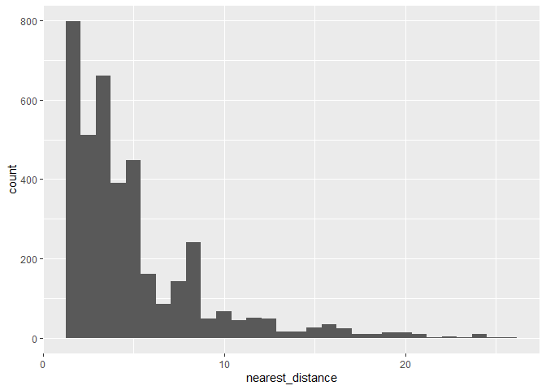
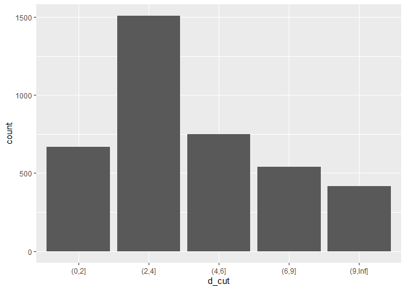
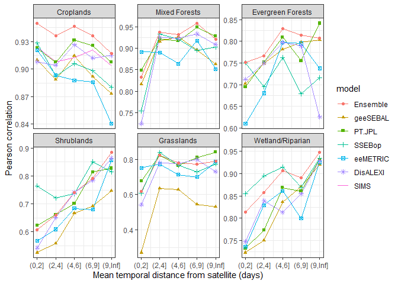
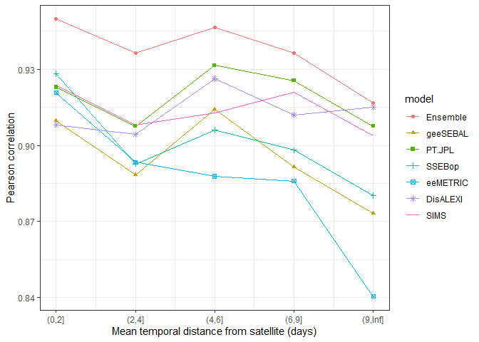
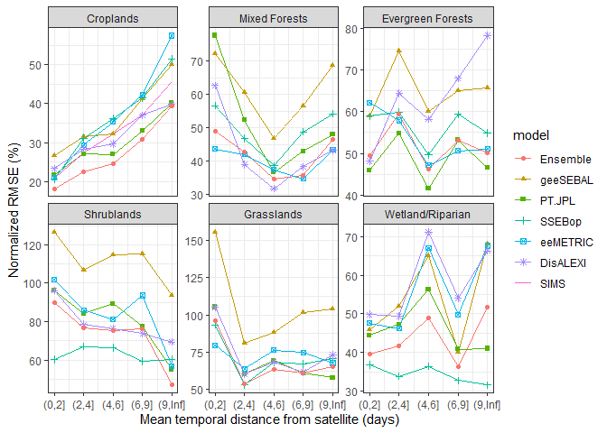
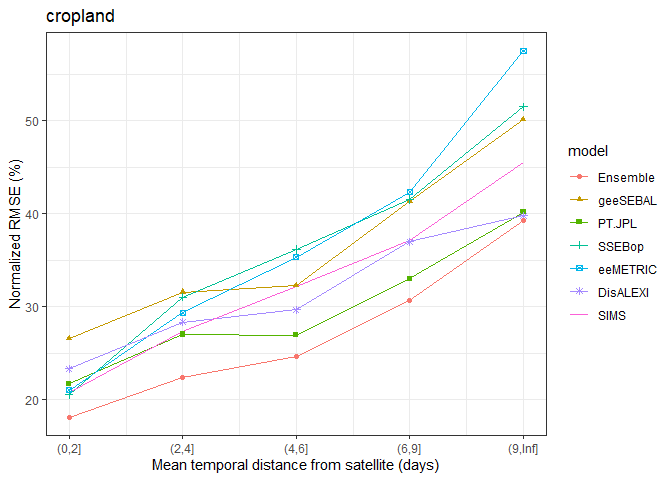
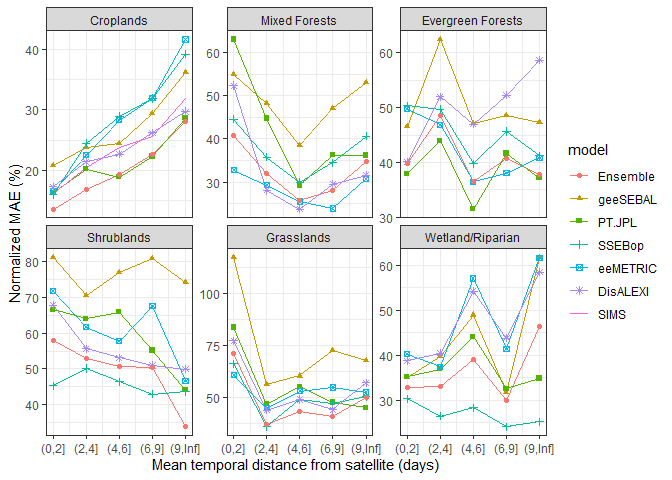
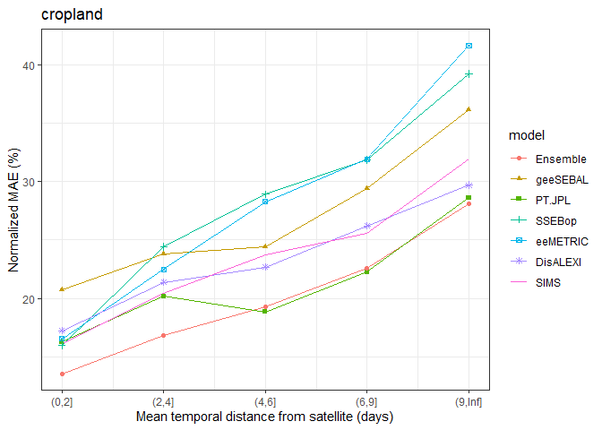
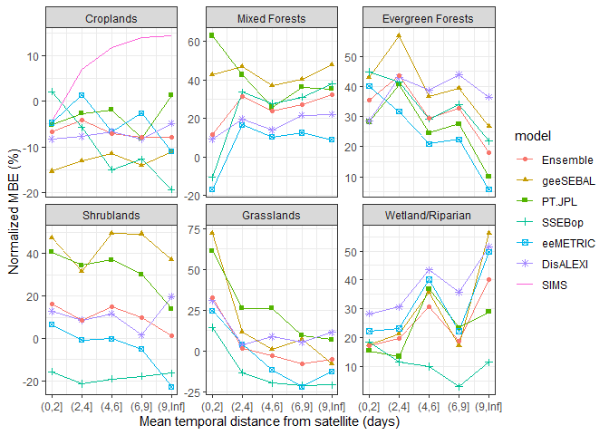
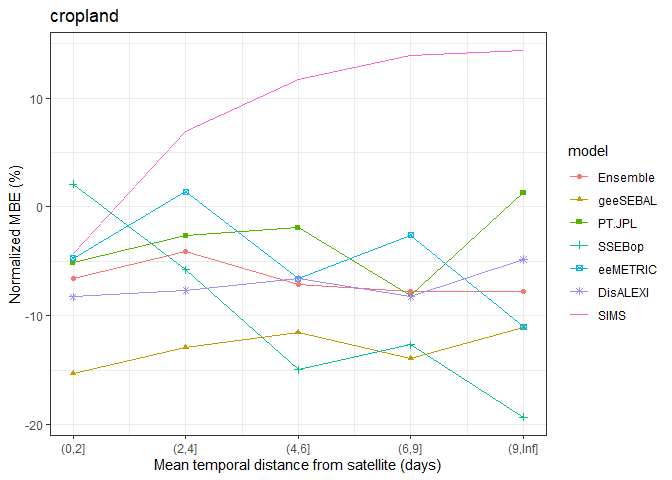

interpolation uncertainty analysis monthlyscale
================
Yeonuk Kim

## Data preparation

``` r
rm(list = ls())

library("tidyverse")
```

    ## ── Attaching core tidyverse packages ──────────────────────── tidyverse 2.0.0 ──
    ## ✔ dplyr     1.1.4     ✔ readr     2.1.5
    ## ✔ forcats   1.0.0     ✔ stringr   1.5.1
    ## ✔ ggplot2   3.5.1     ✔ tibble    3.2.1
    ## ✔ lubridate 1.9.4     ✔ tidyr     1.3.1
    ## ✔ purrr     1.0.2     
    ## ── Conflicts ────────────────────────────────────────── tidyverse_conflicts() ──
    ## ✖ dplyr::filter() masks stats::filter()
    ## ✖ dplyr::lag()    masks stats::lag()
    ## ℹ Use the conflicted package (<http://conflicted.r-lib.org/>) to force all conflicts to become errors

``` r
library("lubridate")
library(Metrics)

# interpolation max days
maxdays <- 32

### daily EC, OpenET, gridMET ETo
df <- read.csv("daily_data.csv")
df <- df %>% 
    mutate(DATE=as.Date(DATE),
                 YEAR = year(DATE),
                 MON = month(DATE)) 


# filter data to OpenET data available period
df <- df %>%
    mutate(RS_OBS = ifelse(!is.na(eeMETRIC),T,F),
                 RS_OBS_SIMS = ifelse(!is.na(SIMS),T,F),
                 ET_OBS = ifelse(!is.na(ET_corr),T,F)
    )

vaild_date <- df %>%
    filter(RS_OBS) %>%
    group_by(site) %>%
    summarise(start = min(DATE) - maxdays,
                        end = max(DATE) + maxdays)


df <- df %>% left_join(vaild_date)
```

    ## Joining with `by = join_by(site)`

``` r
df <- df %>% filter(DATE >= start & DATE <= end) %>%
    select(!start) %>% select(!end)


###
meta <- read.csv("station_metadata.csv",skip = 1)
colnames(meta)[1] <- "site"

meta_use <- meta %>% 
    select(site,General.classification,Land.cover.type) %>%
    rename(site=site, 
                 class1 = General.classification,
                 class2 = Land.cover.type) %>%
    mutate(is_crop = ifelse(class1 == "Croplands",TRUE,FALSE),
                 class1 = factor(class1,
                                                levels = c("Croplands","Mixed Forests","Evergreen Forests",
                                                                     "Shrublands","Grasslands","Wetland/Riparian",""))
                 )

df <- df %>% left_join(meta_use)
```

    ## Joining with `by = join_by(site)`

``` r
# nearest temporal distance
df <- df %>%
    group_by(site) %>%        
    arrange(DATE) %>%   
    mutate(nearest_distance = sapply(DATE, function(d) {
        if (any(RS_OBS)) {
            min(abs(as.numeric(difftime(DATE[RS_OBS], d, units = "days"))))
        } else {
            Inf  # No RS_OBS in the group at all
        }
    }))
```

## Monthly averaged EC ET, merging OpenET monthly

``` r
df_mon <- df %>%
    mutate(nearest_distance =ifelse(nearest_distance > 32, NA, nearest_distance)) %>%
    group_by(is_crop,class1,class2,site,YEAR,MON) %>%
    summarise(ET_corr_na_count = sum(is.na(ET_corr)),
                        ET_corr = ifelse(ET_corr_na_count == 0, sum(ET_corr,na.rm=T), NA),
                        nearest_distance = mean(nearest_distance),
    ) %>%
    filter(!is.na(ET_corr), !is.na(nearest_distance))
```

    ## `summarise()` has grouped output by 'is_crop', 'class1', 'class2', 'site',
    ## 'YEAR'. You can override using the `.groups` argument.

``` r
OpenET_mon <- read.csv("monthly_openet_data.csv")
OpenET_mon <- OpenET_mon %>% 
    mutate(DATE=as.Date(DATE, tryFormats ="%m/%d/%Y"),
                 YEAR = year(DATE),
                 MON = month(DATE))
colnames(OpenET_mon)[1] <- "site"

# combine dataset
df_mon <- OpenET_mon %>% left_join(df_mon) %>% filter(!is.na(nearest_distance))
```

    ## Joining with `by = join_by(site, YEAR, MON)`

``` r
# distance cut
df_mon <- df_mon %>%
    mutate(d_cut = cut(nearest_distance,
                                         breaks = c(0,2,4,6,9,Inf))
                 )

df_mon %>% ggplot(aes(nearest_distance)) + geom_histogram()
```

    ## `stat_bin()` using `bins = 30`. Pick better value with `binwidth`.

<!-- -->

``` r
df_mon %>% ggplot(aes(d_cut)) + geom_bar()
```

<!-- -->

## correlation

``` r
result <- df_mon %>%
        ungroup() %>%
        group_by(d_cut,class1) %>%
        summarise(ETm = mean(ET_corr,na.rm=T),
                            
                            geeSEBAL = cor(ET_corr,geeSEBAL),
                            PT.JPL = cor(ET_corr,PT.JPL),
                            SSEBop = cor(ET_corr,SSEBop),
                            eeMETRIC = cor(ET_corr,eeMETRIC),
                            DisALEXI = cor(ET_corr,DisALEXI),
                            SIMS = cor(ET_corr,SIMS),
                            Ensemble = cor(ET_corr,Ensemble),
                            
        ) 
```

    ## `summarise()` has grouped output by 'd_cut'. You can override using the
    ## `.groups` argument.

``` r
result %>%
    select(!ETm) %>%
    gather(key = "model",value = "cor", -c(class1,d_cut)) %>%
    mutate(model = factor(model,
                                                levels = c("Ensemble","geeSEBAL","PT.JPL","SSEBop",
                                                                     "eeMETRIC","DisALEXI","SIMS"))
                 ) %>%
    ggplot(aes(as.numeric(d_cut),cor,color = model, shape=model)) +
    scale_x_continuous(breaks = c(1,2,3,4,5),
                     labels = levels(result$d_cut)) +
    geom_line() +
    geom_point() +
    theme_bw() +
    labs(
        y = "Pearson correlation", 
        x = "Mean temporal distance from satellite (days)"
    ) +
    facet_wrap(~class1, scales = "free_y")
```

    ## Warning: The shape palette can deal with a maximum of 6 discrete values because more
    ## than 6 becomes difficult to discriminate
    ## ℹ you have requested 7 values. Consider specifying shapes manually if you need
    ##   that many have them.

    ## Warning: Removed 25 rows containing missing values or values outside the scale range
    ## (`geom_line()`).

    ## Warning: Removed 30 rows containing missing values or values outside the scale range
    ## (`geom_point()`).

<!-- -->

``` r
result %>%
    select(!ETm) %>%
    filter(class1 == "Croplands") %>%
    gather(key = "model",value = "cor", -c(class1,d_cut)) %>%
    mutate(model = factor(model,
                                                levels = c("Ensemble","geeSEBAL","PT.JPL","SSEBop",
                                                                     "eeMETRIC","DisALEXI","SIMS"))
                 ) %>%
    ggplot(aes(as.numeric(d_cut),cor,color = model, shape=model)) +
    scale_x_continuous(breaks = c(1,2,3,4,5),
                     labels = levels(result$d_cut)) +
    geom_line() + 
    geom_point() +
    theme_bw() +
    labs(
        y = "Pearson correlation", 
        x = "Mean temporal distance from satellite (days)"
    )
```

    ## Warning: The shape palette can deal with a maximum of 6 discrete values because more
    ## than 6 becomes difficult to discriminate
    ## ℹ you have requested 7 values. Consider specifying shapes manually if you need
    ##   that many have them.

    ## Warning: Removed 5 rows containing missing values or values outside the scale range
    ## (`geom_point()`).

<!-- -->

## normalized rmse

``` r
result <- df_mon %>%
        ungroup() %>%
        group_by(d_cut,class1) %>%
        summarise(ETm = mean(ET_corr,na.rm=T),
                            
                            geeSEBAL = rmse(ET_corr,geeSEBAL)/ETm,
                            PT.JPL = rmse(ET_corr,PT.JPL)/ETm,
                            SSEBop = rmse(ET_corr,SSEBop)/ETm,
                            eeMETRIC = rmse(ET_corr,eeMETRIC)/ETm,
                            DisALEXI = rmse(ET_corr,DisALEXI)/ETm,
                            SIMS = rmse(ET_corr,SIMS)/ETm,
                            Ensemble = rmse(ET_corr,Ensemble)/ETm,
                            
        ) 
```

    ## `summarise()` has grouped output by 'd_cut'. You can override using the
    ## `.groups` argument.

``` r
result %>%
    select(!ETm) %>%
    gather(key = "model",value = "rmse", -c(class1,d_cut)) %>%
    mutate(model = factor(model,
                                                levels = c("Ensemble","geeSEBAL","PT.JPL","SSEBop",
                                                                     "eeMETRIC","DisALEXI","SIMS"))
                 ) %>%
    ggplot(aes(as.numeric(d_cut),rmse*100,color = model, shape=model)) +
    scale_x_continuous(breaks = c(1,2,3,4,5),
                     labels = levels(result$d_cut)) +
    geom_line() +
    geom_point() +
    theme_bw() +
    labs(
        y = "Normalized RMSE (%)",
        x = "Mean temporal distance from satellite (days)"
    ) +
    facet_wrap(~class1, scales = "free_y")
```

    ## Warning: The shape palette can deal with a maximum of 6 discrete values because more
    ## than 6 becomes difficult to discriminate
    ## ℹ you have requested 7 values. Consider specifying shapes manually if you need
    ##   that many have them.

    ## Warning: Removed 25 rows containing missing values or values outside the scale range
    ## (`geom_line()`).

    ## Warning: Removed 30 rows containing missing values or values outside the scale range
    ## (`geom_point()`).

<!-- -->

``` r
result %>%
    select(!ETm) %>%
    filter(class1 == "Croplands") %>%
    gather(key = "model",value = "rmse", -c(class1,d_cut)) %>%
    mutate(model = factor(model,
                                                levels = c("Ensemble","geeSEBAL","PT.JPL","SSEBop",
                                                                     "eeMETRIC","DisALEXI","SIMS"))
                 ) %>%
    ggplot(aes(as.numeric(d_cut),rmse*100,color = model, shape=model)) +
    scale_x_continuous(breaks = c(1,2,3,4,5),
                     labels = levels(result$d_cut)) +
    geom_line() + 
    geom_point() +
    theme_bw() +
    labs(title = "cropland",
        y = "Normalized RMSE (%)", 
        x = "Mean temporal distance from satellite (days)"
    )
```

    ## Warning: The shape palette can deal with a maximum of 6 discrete values because more
    ## than 6 becomes difficult to discriminate
    ## ℹ you have requested 7 values. Consider specifying shapes manually if you need
    ##   that many have them.

    ## Warning: Removed 5 rows containing missing values or values outside the scale range
    ## (`geom_point()`).

<!-- -->

## normalized mae

``` r
result <- df_mon %>%
        ungroup() %>%
        group_by(d_cut,class1) %>%
        summarise(ETm = mean(ET_corr,na.rm=T),
                            
                            geeSEBAL = mae(ET_corr,geeSEBAL)/ETm,
                            PT.JPL = mae(ET_corr,PT.JPL)/ETm,
                            SSEBop = mae(ET_corr,SSEBop)/ETm,
                            eeMETRIC = mae(ET_corr,eeMETRIC)/ETm,
                            DisALEXI = mae(ET_corr,DisALEXI)/ETm,
                            SIMS = mae(ET_corr,SIMS)/ETm,
                            Ensemble = mae(ET_corr,Ensemble)/ETm,
                            
        ) 
```

    ## `summarise()` has grouped output by 'd_cut'. You can override using the
    ## `.groups` argument.

``` r
result %>%
    select(!ETm) %>%
    gather(key = "model",value = "mae", -c(class1,d_cut)) %>%
    mutate(model = factor(model,
                                                levels = c("Ensemble","geeSEBAL","PT.JPL","SSEBop",
                                                                     "eeMETRIC","DisALEXI","SIMS"))
                 ) %>%
    ggplot(aes(as.numeric(d_cut),mae*100,color = model, shape=model)) +
    scale_x_continuous(breaks = c(1,2,3,4,5),
                     labels = levels(result$d_cut)) +
    geom_line() +
    geom_point() +
    theme_bw() +
    labs(
        y = "Normalized MAE (%)",
        x = "Mean temporal distance from satellite (days)"
    ) +
    facet_wrap(~class1, scales = "free_y")
```

    ## Warning: The shape palette can deal with a maximum of 6 discrete values because more
    ## than 6 becomes difficult to discriminate
    ## ℹ you have requested 7 values. Consider specifying shapes manually if you need
    ##   that many have them.

    ## Warning: Removed 25 rows containing missing values or values outside the scale range
    ## (`geom_line()`).

    ## Warning: Removed 30 rows containing missing values or values outside the scale range
    ## (`geom_point()`).

<!-- -->

``` r
result %>%
    select(!ETm) %>%
    filter(class1 == "Croplands") %>%
    gather(key = "model",value = "mae", -c(class1,d_cut)) %>%
    mutate(model = factor(model,
                                                levels = c("Ensemble","geeSEBAL","PT.JPL","SSEBop",
                                                                     "eeMETRIC","DisALEXI","SIMS"))
                 ) %>%
    ggplot(aes(as.numeric(d_cut),mae*100,color = model, shape=model)) +
    scale_x_continuous(breaks = c(1,2,3,4,5),
                     labels = levels(result$d_cut)) +
    geom_line() + 
    geom_point() +
    theme_bw() +
    labs(title = "cropland",
        y = "Normalized MAE (%)", 
        x = "Mean temporal distance from satellite (days)"
    )
```

    ## Warning: The shape palette can deal with a maximum of 6 discrete values because more
    ## than 6 becomes difficult to discriminate
    ## ℹ you have requested 7 values. Consider specifying shapes manually if you need
    ##   that many have them.

    ## Warning: Removed 5 rows containing missing values or values outside the scale range
    ## (`geom_point()`).

<!-- -->

## normalized mbe

``` r
mbe <- function (actual, predicted) {return(mean(predicted - actual,na.rm=T))}

result <- df_mon %>%
        ungroup() %>%
        group_by(d_cut,class1) %>%
        summarise(ETm = mean(ET_corr,na.rm=T),
                            
                            geeSEBAL = mbe(ET_corr,geeSEBAL)/ETm,
                            PT.JPL = mbe(ET_corr,PT.JPL)/ETm,
                            SSEBop = mbe(ET_corr,SSEBop)/ETm,
                            eeMETRIC = mbe(ET_corr,eeMETRIC)/ETm,
                            DisALEXI = mbe(ET_corr,DisALEXI)/ETm,
                            SIMS = mbe(ET_corr,SIMS)/ETm,
                            Ensemble = mbe(ET_corr,Ensemble)/ETm,
                            
        ) 
```

    ## `summarise()` has grouped output by 'd_cut'. You can override using the
    ## `.groups` argument.

``` r
result %>%
    select(!ETm) %>%
    gather(key = "model",value = "mbe", -c(class1,d_cut)) %>%
    mutate(model = factor(model,
                                                levels = c("Ensemble","geeSEBAL","PT.JPL","SSEBop",
                                                                     "eeMETRIC","DisALEXI","SIMS"))
                 ) %>%
    ggplot(aes(as.numeric(d_cut),mbe*100,color = model, shape=model)) +
    scale_x_continuous(breaks = c(1,2,3,4,5),
                     labels = levels(result$d_cut)) +
    geom_line() +
    geom_point() +
    theme_bw() +
    labs(
        y = "Normalized MBE (%)",
        x = "Mean temporal distance from satellite (days)"
    ) +
    facet_wrap(~class1, scales = "free_y")
```

    ## Warning: The shape palette can deal with a maximum of 6 discrete values because more
    ## than 6 becomes difficult to discriminate
    ## ℹ you have requested 7 values. Consider specifying shapes manually if you need
    ##   that many have them.

    ## Warning: Removed 25 rows containing missing values or values outside the scale range
    ## (`geom_line()`).

    ## Warning: Removed 30 rows containing missing values or values outside the scale range
    ## (`geom_point()`).

<!-- -->

``` r
result %>%
    select(!ETm) %>%
    filter(class1 == "Croplands") %>%
    gather(key = "model",value = "mbe", -c(class1,d_cut)) %>%
    mutate(model = factor(model,
                                                levels = c("Ensemble","geeSEBAL","PT.JPL","SSEBop",
                                                                     "eeMETRIC","DisALEXI","SIMS"))
                 ) %>%
    ggplot(aes(as.numeric(d_cut),mbe*100,color = model, shape=model)) +
    scale_x_continuous(breaks = c(1,2,3,4,5),
                     labels = levels(result$d_cut)) +
    geom_line() + 
    geom_point() +
    theme_bw() +
    labs(title = "cropland",
        y = "Normalized MBE (%)", 
        x = "Mean temporal distance from satellite (days)"
    )
```

    ## Warning: The shape palette can deal with a maximum of 6 discrete values because more
    ## than 6 becomes difficult to discriminate
    ## ℹ you have requested 7 values. Consider specifying shapes manually if you need
    ##   that many have them.

    ## Warning: Removed 5 rows containing missing values or values outside the scale range
    ## (`geom_point()`).

<!-- -->
